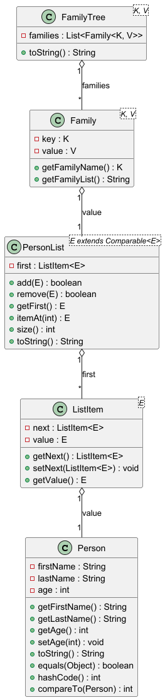

<<<<<<< HEAD
# Aufgabenstellung: Familienbaum-Projekt

## Ziel
Entwickeln Sie ein Java-Programm, das Personen und Familien in einer Baumstruktur verwaltet. Das Programm soll es ermöglichen, Personen zu speichern, sortiert zu verwalten und Familien mit ihren Mitgliedern übersichtlich darzustellen.

## Hauptklassen und deren Aufgaben

### 1. `Person`
- Repräsentiert eine einzelne Person mit Vorname, Nachname und Alter.
- Implementiert Methoden wie `equals`, `hashCode`, `compareTo` und `toString`, um Vergleiche und Ausgaben zu ermöglichen.

### 2. `PersonList<E extends Comparable<E>>`
- Generische, sortierte, einfach verkettete Liste für Personen (oder andere vergleichbare Objekte).
- **Wichtige Methoden:**
    - `add(E value)`: Fügt ein Element sortiert in die Liste ein. Die Methode sucht die richtige Position anhand der Vergleichslogik und fügt das Element dort ein.
    - `remove(E value)`: Entfernt das erste Vorkommen eines Elements aus der Liste.
    - `itemAt(int pos)`: Gibt das Element an einer bestimmten Position zurück.
    - `size()`: Gibt die Anzahl der Elemente in der Liste zurück.
    - `toString()`: Gibt eine formatierte Liste aller Elemente mit Index aus.

### 3. `Family<K, V>`
- Repräsentiert eine Familie mit einem Familiennamen (`key`) und einer Liste von Familienmitgliedern (`value`).
- **Wichtige Methoden:**
    - `getFamilyName()`: Gibt den Namen der Familie zurück.
    - `getFamilyList()`: Gibt die Mitgliederliste als String zurück.

### 4. `FamilyTree<K, V>`
- Verwaltet eine Liste von Familien.
- **Wichtige Methode:**
    - `toString()`: Gibt alle Familien mit ihren Mitgliedern formatiert aus. Die Methode iteriert über alle Familien und gibt jeweils den Namen und die Mitgliederliste aus, getrennt durch eine Linie.

## Tests
- Es gibt Unit-Tests für die wichtigsten Funktionen (`PersonTest`, `FamilyTreeTest`).
    - `PersonTest` prüft Konstruktor, `toString`, Gleichheit, `hashCode`, Alters-Setzen und Vergleich.
    - `FamilyTreeTest` prüft die korrekte Ausgabe der Familienstruktur.

## Hinweise
- Die Methoden `add` in `PersonList` und `toString` in `FamilyTree` sind besonders wichtig, da sie die sortierte Einfügung und die formatierte Ausgabe der Datenstruktur sicherstellen.
- Die Tests helfen, die Korrektheit dieser Methoden zu überprüfen.

---

**Aufgabe:**
Implementieren Sie die beschriebenen Klassen und Methoden. Schreiben Sie Unit-Tests, um die Funktionalität zu überprüfen. Achten Sie besonders auf die korrekte Sortierung in der `PersonList` und die formatierte Ausgabe im `FamilyTree`.

=======
# Aufgabenstellung: Familienbaum-Projekt

## Ziel
Entwickeln Sie ein Java-Programm, das Personen und Familien in einer Baumstruktur verwaltet. Das Programm soll es ermöglichen, Personen zu speichern, sortiert zu verwalten und Familien mit ihren Mitgliedern übersichtlich darzustellen.

## Hauptklassen und deren Aufgaben

### 1. `Person`
- Repräsentiert eine einzelne Person mit Vorname, Nachname und Alter.
- Implementiert Methoden wie `equals`, `hashCode`, `compareTo` und `toString`, um Vergleiche und Ausgaben zu ermöglichen.

### 2. `PersonList<E extends Comparable<E>>`
- Generische, sortierte, einfach verkettete Liste für Personen (oder andere vergleichbare Objekte).
- **Wichtige Methoden:**
    - `add(E value)`: Fügt ein Element sortiert in die Liste ein. Die Methode sucht die richtige Position anhand der Vergleichslogik und fügt das Element dort ein.
    - `remove(E value)`: Entfernt das erste Vorkommen eines Elements aus der Liste.
    - `itemAt(int pos)`: Gibt das Element an einer bestimmten Position zurück.
    - `size()`: Gibt die Anzahl der Elemente in der Liste zurück.
    - `toString()`: Gibt eine formatierte Liste aller Elemente mit Index aus.

### 3. `Family<K, V>`
- Repräsentiert eine Familie mit einem Familiennamen (`key`) und einer Liste von Familienmitgliedern (`value`).
- **Wichtige Methoden:**
    - `getFamilyName()`: Gibt den Namen der Familie zurück.
    - `getFamilyList()`: Gibt die Mitgliederliste als String zurück.

### 4. `FamilyTree<K, V>`
- Verwaltet eine Liste von Familien.
- **Wichtige Methode:**
    - `toString()`: Gibt alle Familien mit ihren Mitgliedern formatiert aus. Die Methode iteriert über alle Familien und gibt jeweils den Namen und die Mitgliederliste aus, getrennt durch eine Linie.

## Tests
- Es gibt Unit-Tests für die wichtigsten Funktionen (`PersonTest`, `FamilyTreeTest`).
    - `PersonTest` prüft Konstruktor, `toString`, Gleichheit, `hashCode`, Alters-Setzen und Vergleich.
    - `FamilyTreeTest` prüft die korrekte Ausgabe der Familienstruktur.

## Hinweise
- Die Methoden `add` in `PersonList` und `toString` in `FamilyTree` sind besonders wichtig, da sie die sortierte Einfügung und die formatierte Ausgabe der Datenstruktur sicherstellen.
- Die Tests helfen, die Korrektheit dieser Methoden zu überprüfen.

---

**Aufgabe:**
Implementieren Sie die beschriebenen Klassen und Methoden. Schreiben Sie Unit-Tests, um die Funktionalität zu überprüfen. Achten Sie besonders auf die korrekte Sortierung in der `PersonList` und die formatierte Ausgabe im `FamilyTree`.

